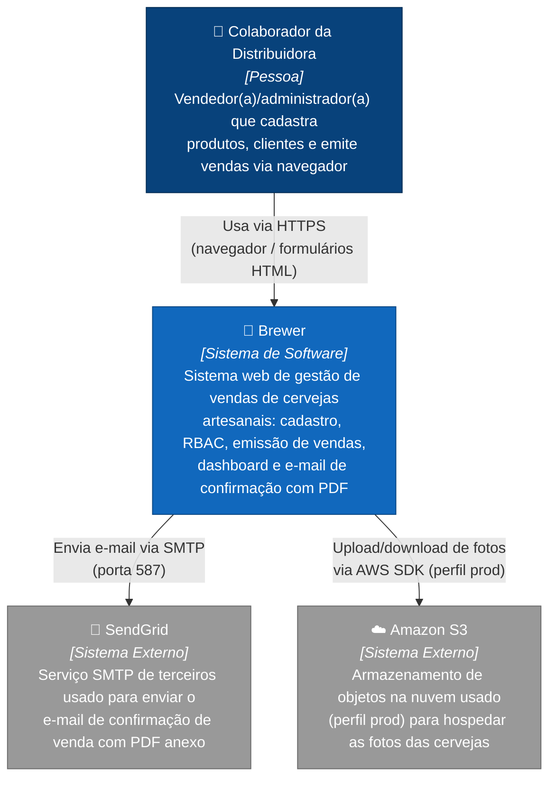

# 01 · Diagrama de Contexto (C4 Nível 1)

[⬅ Voltar ao Modelo C4](README.md)

Mostra o sistema Brewer como uma "caixa preta", quem o usa e com quais sistemas externos ele troca
informação.

## Notas

- Não há APIs públicas ou integrações de sistema-a-sistema além das duas listadas: o Brewer é
  consumido diretamente por um humano via navegador (aplicação server-side rendered, sem SPA/API
  REST separada).
- O uso do Amazon S3 é condicional ao perfil Spring `prod` (`S3Config` é `@Profile("prod")`); fora
  desse perfil, as fotos ficam em armazenamento local (ver [02 · Diagrama de Contêineres](02-containers.md)).
- O envio de e-mail (`MailConfig`) está sempre configurado para usar o host SMTP do SendGrid
  (`smtp.sendgrid.net:587`), com credenciais vindas de variável de ambiente
  (`BREWER_EMAIL_USERNAME`/`BREWER_EMAIL_PASSWORD`).

## Próxima leitura

- [02 · Diagrama de Contêineres](02-containers.md)
