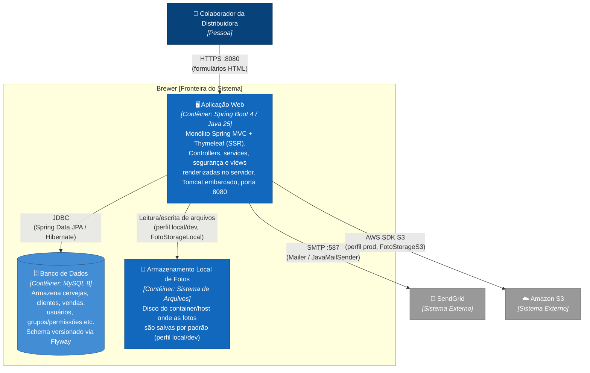

# 02 · Diagrama de Contêineres (C4 Nível 2)

[⬅ Voltar ao Modelo C4](README.md)

Faz o zoom dentro do sistema Brewer e mostra as "unidades de deploy" (contêineres, no sentido do C4
model — não necessariamente containers Docker, embora aqui coincidam) e como elas se comunicam.

## Mapeamento para Docker / Docker Compose

| Contêiner (C4) | Serviço em `docker-compose.yml` | Observação |
|---|---|---|
| Aplicação Web | `app` | Build multi-stage via `Dockerfile` (Maven → JRE Alpine), roda como usuário não-root |
| Banco de Dados | `mysql` | MySQL 8, com `healthcheck`; `docker-entrypoint.sh` aguarda a porta responder antes de subir a app |
| Armazenamento Local | *(volume/diretório dentro do container `app`)* | Caminho configurável via `BREWER_FOTO_STORAGE_LOCAL_PATH` |

Detalhes de execução local/Docker: [08 · Execução Local e Docker](../08-execucao-local-e-docker.md).

## Notas de deploy

- Apenas **um contêiner de aplicação** (monólito) — não há separação em microsserviços, gateway de
  API ou frontend SPA separado.
- A escolha entre `localdisk` e `s3` para fotos é feita em tempo de execução pelo padrão **Strategy**
  (`FotoStorage` → `FotoStorageLocal` ou `FotoStorageS3`), conforme o perfil Spring ativo.
- `spring-boot-devtools` (escopo runtime) habilita restart automático apenas em desenvolvimento, sem
  impacto nos contêineres de produção.

## Próxima leitura

- [03 · Diagrama de Componentes](03-componentes.md)
- [01 · Diagrama de Contexto](01-contexto.md)
