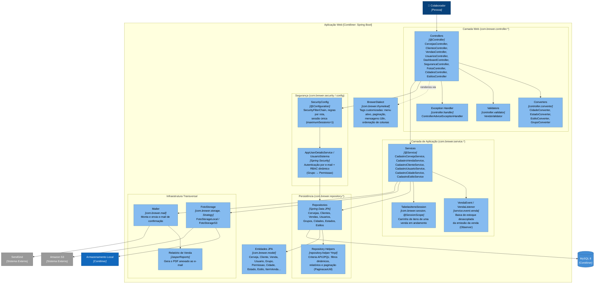

# 03 · Diagrama de Componentes (C4 Nível 3)

[⬅ Voltar ao Modelo C4](README.md)

Faz o zoom dentro do contêiner **Aplicação Web**, agrupando as classes de
`src/main/java/com/brewer` por responsabilidade (pacote). Cada caixa é um componente lógico
(no sentido de "conjunto coeso de classes"), não uma classe isolada.

## Componentes por camada

| Grupo | Pacote(s) | Componentes principais | Padrão de projeto |
|---|---|---|---|
| Camada Web | `controller`, `controller.converter/handler/validator` | `*Controller`, `*Converter`, `VendaValidator`, `ControllerAdviceExceptionHandler` | MVC, Converter, Validator, Chain of Responsibility |
| Extensão de View | `thymeleaf`, `thymeleaf.processor` | `BrewerDialect` | Dialect/Tag Processor |
| Segurança | `security`, `config` (`SecurityConfig`) | `AppUserDetailsService`, `UsuarioSistema` | Adapter (domínio ↔ Spring Security) |
| Aplicação | `service`, `service.event.venda`, `session` | `Cadastro*Service`, `VendaEvent`/`VendaListener`, `TabelasItensSession` | Observer/Domain Event, Session-scoped Component |
| Persistência | `repository`, `repository.filter`, `repository.helper.*`, `repository.paginacao` | `Cervejas`, `Vendas`, `*Impl`, `PaginacaoUtil` | Repository, Specification/Filtro dinâmico |
| Domínio | `model`, `model.validation` | `Cerveja`, `Venda`, `Usuario`, `ClienteGroupSequenceProvider` | Rich Domain Model |
| Infraestrutura transversal | `storage`, `mail`, `config` | `FotoStorage` (+ `local`/`s3`), `Mailer`, JasperReports | Strategy |

Ver detalhamento completo de cada padrão em [02 · Arquitetura](../02-arquitetura.md#padrões-de-projeto-aplicados).

## Próxima leitura

- [04 · Diagrama Dinâmico (emissão de venda)](04-dinamico.md)
- [02 · Diagrama de Contêineres](02-containers.md)
