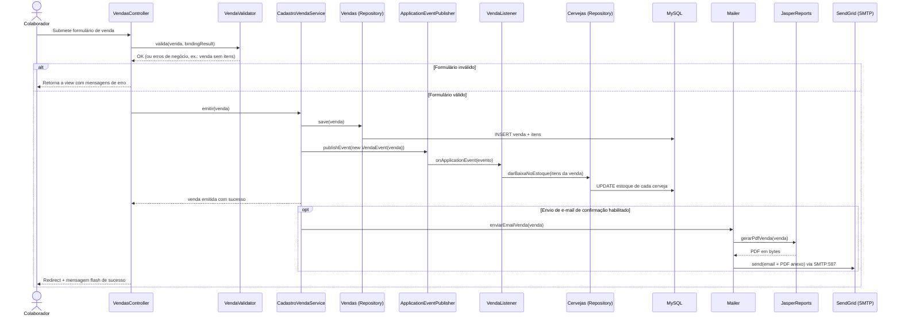

# 04 · Diagrama Dinâmico — Emissão de Venda (C4 Nível "Dynamic")

[⬅ Voltar ao Modelo C4](README.md)

O diagrama dinâmico do C4 model documenta como os componentes colaboram para realizar **um caso de
uso específico**, em ordem de execução — complementando o diagrama de componentes (que é estático).
Aqui detalhamos o fluxo de **emissão de uma venda**, já resumido em
[02 · Arquitetura](../02-arquitetura.md#fluxo-típico-de-uma-requisição-exemplo-emitir-uma-venda).

## Passo a passo

1. O colaborador submete o formulário de venda (itens já estavam no carrinho em sessão —
   `TabelasItensSession` — antes deste passo).
2. `VendasController#emitir` delega a validação de negócio ao `VendaValidator` (ex.: venda sem
   itens é rejeitada aqui, além das validações Bean Validation já aplicadas no binding).
3. Se válida, o controller delega a `CadastroVendaService#emitir`.
4. O service persiste a venda (e seus itens) via o repository `Vendas`.
5. O service publica um `VendaEvent` via `ApplicationEventPublisher` — desacoplando a baixa de
   estoque da própria emissão da venda (padrão Observer/Domain Event).
6. `VendaListener`, escutando o evento (`@EventListener`), dá baixa no estoque de cada `Cerveja`
   vendida através do repository `Cervejas`.
7. Opcionalmente, o `Mailer` gera o PDF da venda via JasperReports e envia o e-mail de confirmação
   através do SMTP do SendGrid.
8. O controller redireciona o colaborador com uma mensagem flash de sucesso
   (`RedirectAttributes`).

## Próxima leitura

- [03 · Diagrama de Componentes](03-componentes.md)
- [README do Modelo C4](README.md)
